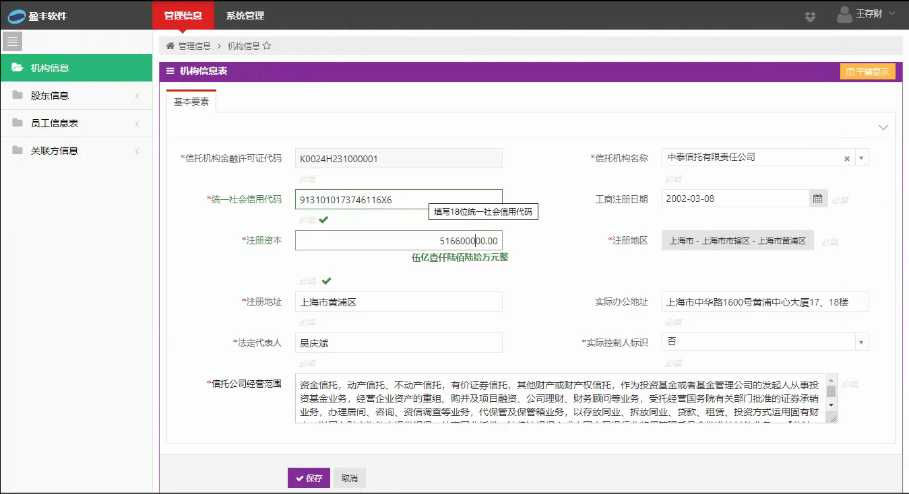
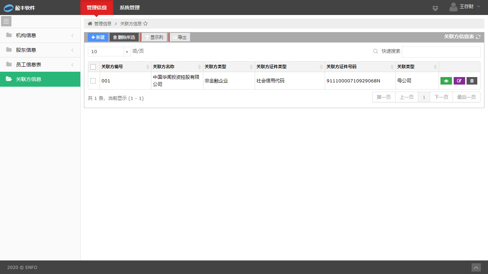

# 1、 信托公司管理信息 EAST4、EAST3 数据对照说明

## 1.1. 字段对对照

### 1.1.1. 机构信息表

| 序号 | EAST4 字段名称         | EAST4 字典 | EAST3            | EAST3 字典 |
| ---: | ---------------------- | ---------- | ---------------- | ---------- |
|    1 | 信托机构名称           |            | 信托机构名称     |            |
|    2 | 信托机构金融许可证代码 | 2001       | 金融许可证号     |            |
|    3 | 统一社会信用代码       |            | 统一社会信用代码 |            |
|    4 | 信托公司经营范围       |            |                  |            |
|    5 | 注册资本               |            | 注册资本         |            |
|    6 | 注册地区               | 1001/1003  | 注册地区         | 003012     |
|    7 | 注册地址               |            |                  |            |
|    8 | 实际办公地址           |            | 机构地址         |            |
|    9 | 法定代表人             |            | 法人姓名         |            |
|   10 | 实际控制人标识         | 2002       |                  | 001005     |
|   11 | 实际控制人类型         | 2003       |                  |            |
|   12 | 实际控制人名称         |            |                  |            |
|   13 | 实际控制人证件类型     | 2004       |                  |            |
|   14 | 实际控制人证件号码     |            |                  |            |
|   15 | 工商注册日期           |            | 成立时间         |            |

### 1.1.2. 股东信息表

| 序号 | EAST4 字段名称     | EAST4 字典 | EAST3        | EAST3 字典 |
| ---: | ------------------ | :--------: | ------------ | :--------: |
|    1 | 股东类型           |    2003    | 股东类别     |   003003   |
|    2 | 股东名称           |            | 股东名称     |            |
|    3 | 股东证件类型       |    2004    | 股东证件类型 |   003006   |
|    4 | 股东证件号码       |            | 股东证件号码 |            |
|    5 | 法定代表人         |            |              |            |
|    6 | 股东业务或经营范围 |            |              |            |
|    7 | 控股方式           |    2005    | 控股方式     |   003030   |
|    8 | 持股比例           |            | 持股比例     |            |
|    9 | 机构性质           |    2006    |              |            |
|   10 | 企业注册类别       |    2007    |              |            |
|   11 | 行业分类           |    2008    |              |            |
|   12 | 行业明细           |    1002    |              |            |
|   13 | 工商注册日期       |            |              |            |
|   14 | 注册资本           |            |              |            |
|   15 | 注册地区           | 1001/1003  |              |            |
|   16 | 注册地址           |            |              |            |
|   17 | 实际办公地址       |            |              |            |
|   18 | 实际控制人标识     |    2002    |              |            |
|   19 | 实际控制人类型     |    2003    |              |            |
|   20 | 实际控制人名称     |            |              |            |
|   21 | 实际控制人证件类型 |    2004    |              |            |
|   22 | 实际控制人证件号码 |            |              |            |
|   23 | 最终受益人名称     |            |              |            |
|   24 | 最终受益人证件类型 |    2004    |              |            |
|   25 | 最终受益人证件号码 |            |              |            |
|   26 | 股东状态           |    2009    | 股东状态     |   001025   |
|   27 | 一致行动人标识     |    2002    |              |            |
|   28 | 一致行动人组别     |            |              |            |
|   29 | 股权是否质押       |            |              |            |
|   30 | 股权质押比例       |            |              |            |
|   31 | 股权是否冻结       |    2002    |              |            |
|   32 | 股权冻结比例       |            |              |            |

### 1.1.3. 员工信息表

| 序号 | EAST4 字段名称 | EAST4 字典 | EAST3    | EAST3 字典 |
| ---: | -------------- | :--------: | -------- | :--------: |
|    1 | 员工号         |            | 员工工号 |            |
|    2 | 员工姓名       |            | 员工姓名 |            |
|    3 | 员工证件类型   |    2010    | 证件类型 |   003007   |
|    4 | 员工证件号码   |            | 证件号码 |            |
|    5 | 政治面貌       |    2011    |          |            |
|    6 | 联系电话       |            | 联系电话 |            |
|    7 | 所属部门       |            | 所属部门 |            |
|    8 | 所属部门分类   |    2012    |          |            |
|    9 | 员工职务       |            | 职务     |            |
|   10 | 是否高管       |    2002    | 是否高管 |   001005   |
|   11 | 员工编制       |    2013    |          |            |
|   12 | 员工状态       |            | 员工状态 |   001022   |
|   13 | 入职日期       |            |          |            |
|   14 | 离职日期       |            |          |            |
|   15 | 办公地区       | 1001/1003  |          |            |
|   16 | 岗位名称       |            |          |            |
|   17 | 岗位描述       |            |          |            |

### 1.1.4. 关联方信息表（**==新增表==**）

| 序号 | EAST4 字段名称       | EAST4 字典 | EAST3 | EAST3 字典 |
| ---: | -------------------- | :--------: | ----- | :--------: |
|    1 | 关联方编号           |            |       |            |
|    2 | 关联方类型           |    2003    |       |            |
|    3 | 关联类型             |    2015    |       |            |
|    4 | 关联方名称           |            |       |            |
|    5 | 关联方证件类型       |    2004    |       |            |
|    6 | 关联方证件号码       |            |       |            |
|    7 | 关联方业务或经营范围 |            |       |            |
|    8 | 行业分类             |    2008    |       |            |
|    9 | 行业明细             |    1002    |       |            |
|   10 | 企业注册类别         |    2007    |       |            |
|   11 | 工商注册日期         |            |       |            |
|   12 | 注册资本             |            |       |            |
|   13 | 注册地区             | 1001\1003  |       |            |
|   14 | 注册地址             |            |       |            |
|   15 | 实际办公地址         |            |       |            |

## 1.2. 码表对照关系

### 1.2.1. 1002 行业明细 <--> 003021	行业明细

都按《GB/T 4754 国民经济行业分类》 

### 1.2.2. 2002 是否标志  <--> 001005 是否标志

| EAST4 | EAST3 |
| ----- | ----- |
| 1-是  | 是    |
| 0-否  | 否    |

> **对照关系说明**
> - 完全匹配

### 1.2.3. 2003 主休类别  <--> 003003 客户类别

| EAST4              | EAST3      |
| ------------------ | ---------- |
| 1-自然人           | 个人       |
| 2-个体工商户       | 个人       |
| 3-广义政府         |            |
| 4-非金融企业       | 非金融机构 |
| 5-金融机构（实体） | 金融机构   |
| 6-特定目的载体     |            |
| 7-境外             |            |

> **对照关系说明**
> - 自然人
>   - EAST4 "自然人" 匹配 EAST3 个人
> - 机构 
>   - EAST4 "金融机构（实体）" 匹配 EAST3 金融机构 ，EAST
>   - EAST4 其他的类型（广义政府、非金融企业、特定目的载体、境外） 无法从EAST3中转换

### 1.2.4. 2004 证件类型(个人+机构+社团) <--> 003006 证件类型

| EAST4                     | EAST3                        |
| ------------------------- | ---------------------------- |
| 10-居民身份证             | 居民身份证                   |
| 11-临时居民身份证         | 临时身份证                   |
| 12-户口薄                 | 户口簿                       |
| 13-普通护照               | ==护照==                     |
| 14-外交护照               | ==护照==                     |
| 15-公务护照               | ==护照==                     |
| 16-公务普通护照           | ==护照==                     |
| 17-中国人民解放军军官证   | 军官证                       |
| 18-中国人民解放军士兵证   | 士兵证                       |
| 19-人民警察证             | 警官证                       |
| 1A-港澳居民居住证         |                              |
| 1B-台湾居民居住证         |                              |
| 1C-港澳居民来往内地通行证 | 港澳居民来往内地通行证       |
| 1D-台湾居民来往大陆通行证 | 台湾同胞来往内地通行证       |
| 1E-外国人永久居留身份证   | ==外国人居留证==             |
| 1F-外国人居留或居留许可   | ==外国人居留证==             |
| 1G-外国人临时居留证       | ==外国人居留证==             |
| 1Z-其他个人有效身份证件   | 其他 、无证件                |
| 21-组织机构代码           | 组织机构代码                 |
| 22-营业执照号(工商注册号) | 营业执照号                   |
| 23-社会信用代码           | 统一社会信用代码             |
| 24-事业单位证书号         |                              |
| 25-社会团体登记号         |                              |
| 26-机关法人成立批文       |                              |
| 31-登记信息               |                              |
| 32-信托产品登记编码       | TITOT内部产品、TETOT外部产品 |
| 33-业务许可证             | 金融许可证                   |
| 34-法人登记证             |                              |
| 35-备案证明               |                              |
| 36-批文                   |                              |
| 37-确认函                 |                              |
| 99-其他                   | 其他、税务登记号             |

> **对照关系说明**
> - EAST4 “普通护照、外交护照、公务护照、公务普通护照” 匹配  EAST3 “护照”，但EAST3 “护照”无法转换为EAST4 的证件类型；
> - EAST4 "外国人永久居留身份证、外国人居留或居留许可、外国人临时居留证" 匹配 EAST3 "外国人居留证",但EAST3 “外国人居留证” 无法转换为EAST4 的相关证件类型；
>   EAST 4 没有提供 “无证件” 类型

### 1.2.5. 2005 控股方式  <--> 003030 控股方式

| EAST4      | EAST3    |
| ---------- | -------- |
| 1-绝对控股 | 绝对控股 |
| 2-相对控股 | 相对控股 |
| 3-一般持股 |          |

> **对照关系说明**
> - 新增3-一股持股，预计会增加股东记录数

## 1.2.6. 2006 机构性质  <--> 003019企业性质

| EAST4                                | EAST3                            |
| ------------------------------------ | -------------------------------- |
| 1-企业法人(公司、非公司制企业法人)   | 公司制企业法人、非公司制企业法人 |
| 2-企业非法人(个人独资企业、合伙企业) | 个人独资企业、合伙企业           |
| 3-行政机关                           | 国家机关                         |
| 4-事业单位                           | 事业单位                         |
| 5-社会团体                           | 社会团体                         |
| 6-其他                               | 军队、个体工商户、其他           |

> **对照关系说明**
> - 完全匹配

## 1.2.7. 2007 企业注册类别 <--> ??

| EAST4                | EAST3 |
| -------------------- | ----- |
| 1-有限责任公司       |       |
| 2-股份有限公司       |       |
| 3-分公司             |       |
| 4-非公司企业法人     |       |
| 5-营业单位           |       |
| 6-企业非法人分支机构 |       |
| 7-个人独资企业       |       |
| 8-合伙企业           |       |
| 9-中外合作企业       |       |
| 10-中外合资企业      |       |
| 11-外资企业          |       |

> **对照关系说明**
> - 新增字典

### 1.2.8. 2008 行业分类（大类） <--> 003020 行业分类

| EAST4      | EAST3    |
| ---------- | -------- |
| 1-基础产业 | 基础产业 |
| 2-房地产   | 房地产   |
| 3-证券     | 证券     |
| 4-金融机构 | 金融机构 |
| 5-工商企业 | 工商企业 |
| 6-其他     | 其他     |

> **对照关系说明**
> - 完全匹配

### 1.2.9. 2009 股东状态 <--> 001025 有效状态

| EAST4  | EAST3 |
| ------ | ----- |
| 0-无效 | 无效  |
| 1-有效 | 有效  |

> **对照关系说明**
> - 完全匹配

### 1.2.10. 2010 证件类型(个人) <--> 003007 个人证件类型

| EAST4                     | EAST3                  |
| ------------------------- | ---------------------- |
| 01-居民身份证             | 居民身份证             |
| 02-临时居民身份证         | 临时身份证             |
| 03-户口薄                 | 户口簿                 |
| 04-普通护照               | ==护照==               |
| 05-外交护照               | ==护照==               |
| 06-公务护照               | ==护照==               |
| 07-公务普通护照           | ==护照==               |
| 08-中国人民解放军军官证   | 军官证                 |
| 09-中国人民解放军士兵证   | 士兵证                 |
| 10-人民警察证             | 警官证                 |
| 11-港澳居民居住证         |                        |
| 12-台湾居民居住证         |                        |
| 13-港澳居民来往内地通行证 | 港澳居民来往内地通行证 |
| 14-台湾居民来往大陆通行证 | 台湾同胞来往内地通行证 |
| 15-外国人永久居留身份证   | ==外国人居留证==       |
| 16-外国人居留或居留许可   | ==外国人居留证==       |
| 17-外国人临时居留证       | ==外国人居留证==       |
| 18-其他个人有效身份证件   | 其他                   |

> **对照关系说明**
> - EAST4 “普通护照、外交护照、公务护照、公务普通护照” 匹配  EAST3 “护照”，但EAST3 “护照”无法转换为EAST4 的证件类型；
> - EAST4 "外国人永久居留身份证、外国人居留或居留许可、外国人临时居留证" 匹配 EAST3 "外国人居留证",但EAST3 “外国人居留证” 无法转换为EAST4 的相关证件类型；
>   EAST 4 没有提供 “无证件” 类型

### 1.2.10. 2011 政治面貌

| EAST4             | EAST3 |
| ----------------- | ----- |
| 1-中共党员        |       |
| 2-中共预备党员    |       |
| 3-共青团员        |       |
| 4-民革会员        |       |
| 5-民盟盟员        |       |
| 6-民建会员        |       |
| 7-农工党党员      |       |
| 8-九三学社社员    |       |
| 9-台盟盟员        |       |
| 10-无党派民主人士 |       |
| 11-群众           |       |

> **对照关系说明**
> - 新增字典

### 1.2.11. 2012 部门分类

| EAST4      | EAST3 |
| ---------- | ----- |
| 1-业务部   |       |
| 2-法规部   |       |
| 3-风控部   |       |
| 4-运营部   |       |
| 5-科技部   |       |
| 6-财富团队 |       |
| 7-财会部   |       |
| 8-战略部   |       |
| 9-人力部   |       |
| 10-高管层  |       |
| 11-其他    |       |

> **对照关系说明**
> - 新增字典

### 1.2.12. 2013 员工编制

| EAST4            | EAST3 |
| ---------------- | ----- |
| 1-正式员工(默认) |       |
| 2-非正式员工     |       |

> **对照关系说明**
> - 新增字典

### 1.2.13. 2014 员工状态

| EAST4        | EAST3 |
| ------------ | ----- |
| 1-待岗       |       |
| 2-在职(默认) |       |
| 3-离职       |       |
| 4-停职       |       |
| 5-退休       |       |
| 6-长期休假   |       |
| 7-其他       |       |

> **对照关系说明**
> - 新增字典

### 1.2.14.  2015 关联类型 <--> 003028	关联类型

| EAST4                                                        | EAST3                                                    |
| ------------------------------------------------------------ | -------------------------------------------------------- |
| 1-母公司                                                     | 公司的股东                                               |
| 2-受同一母公司控制的其他企业                                 | 公司股东的关联企业                                       |
| 3-直接或间接持有本公司5%以上股份的自然人及其关系密切的家庭成员 | 公司自有资金投资的企业、公司自有资金投资的企业的关联企业 |
| 4-本公司董事、监事及高级管理人员及其关系密切的家庭成员       |                                                          |
| 5-母公司的董事、监事及高级管理人员                           | 公司的董事、监事、经理                                   |
| 6-关联自然人直接或间接控制、或担任董事、监事及高级管理人员的其他企业 |                                                          |
| 7-公司的董事、监事、高级管理人员且投资持股5%以上             | 公司的董事、监事、经理投资持股5%以上                     |
| 8-其他关联                                                   | 其他关联                                                 |

> **对照关系说明**
> - EAST4 没有与 EAST3 关联关系类型为“公司以托管或信托等其他方式控制的企业” 的对照关系
> - EAST4 母公司 虽然可以 对照 EAST3 公司股东，但并非所有股东为母公司，其他股东是否需要报送 ？

# 2.EAST4 报送

## 2.1. 报送依据

根据 《中国银保监会办公厅关于印发信托业监管数据标准化规范的通知》（银保监办发【2019】237号），2020年4月15日前，报送2019年1月1日至2020年3月31日全量信托公司管理数据，包括机构信息表、股东信息表、员工信息表和关联方信息表，从2020年5月起，逐月报送变化量数据。

## 2.2. 信托公司管理信息 系统 
根据盈丰软件的 “信托公司管理信息” 系统，各自分别维护 机构信息表、股东信息表、员工信息表、关联方。

### 2.2.1. 机构信息表 
- **机构信查询**

- **机构信息编辑**

### 2.2.2. 股东信息表
- **股东信查询**

- **股东信息编辑**

### 2.2.3. 员工信息表
- **员工信查询**

- **员工信息编辑**

### 2.2.4. 关联方信息表
- **关联方信查询**

- **关联方信息编辑**

## 2.3. 初始公司管理数据（2020.4.15)
### 2.3.1 系统录入
人工将每个表、每条记录按要求录入系统。功能参见2.2.图中所示。
### 2.3.2. EXCEL导入
- 根据EAST4 "信托公司管理信息" 的内容，提供 股东信息表、员工信息表、关联方信息表的的EXCEL填写模板；
- 维护好各表数据；
- 导入Excel文件到系统中

 ### 2.3.3. 基于EAST3 数据转换导入
- **股东信息表、员工信息表 可在EAST3 数据的基础上进行维护：**
    - 转换对照匹配通过的数据（见第一部分）导出EXCEL文件(同2.2.2文件格式);
    - 对新增的字段进行补录；
    - 使用系统导入的功能，导入数；

- **关联方信息数据**
    - 汇总提取 EAST3 相关表[信托客户（个人）、信托客户（机构）、交易对手（个人）、交易对手（机构）] 关联客户信息；
    - 根据提取到的关联方，进行数据筛选；
    - 对筛选的数据进行编辑；
    - 增加新的关联方记录；
